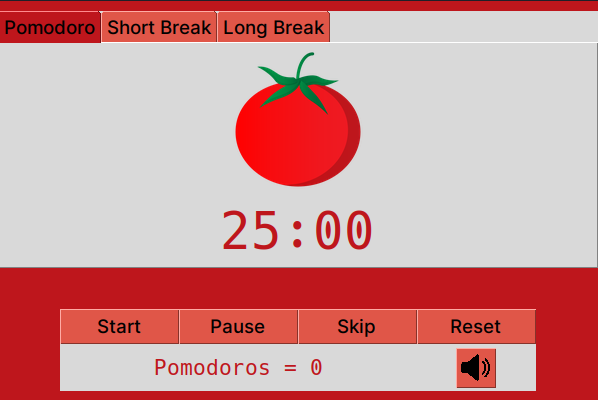

# Pomodoro desktop app

A simple pomodoro desktop app built with Tkinter. It alternates 25 minutes of concentration (pomodoros), with a small pause of 5 minutes. When it completes 4 pomodoros, there's a longer pause of 15 minutes.




## Features

- Start
- Pause
- Skip: allows you to skip from pomodoro to the next rest or from the rest to the next pomodoro.
- Restart
- Pomodoro counter: keeps track of your your pomodoros.
- Relaxing sound button: plays ambient sound for improved concentration.
- When the ambient sound is activated, it stops when it's time to rest and resumes playing during the pomodoro time.
- It produces an alert sound  when a pomodoro (25 minutes) is completed, and a different sound when a pause is finished.


## Requirements:

- Python 3
- Tkinter
- pygame


## Usage

Whith all requirements accomplished
Open a terminal and go to the directory called 'pomodoros' which contains all project files.
Enter this command to run the application from the project's directory:
```
python3 main.py
```

## Future Plans

- I plan to add the option to select different sounds from a checkbox, such as rain sound or white noise.
